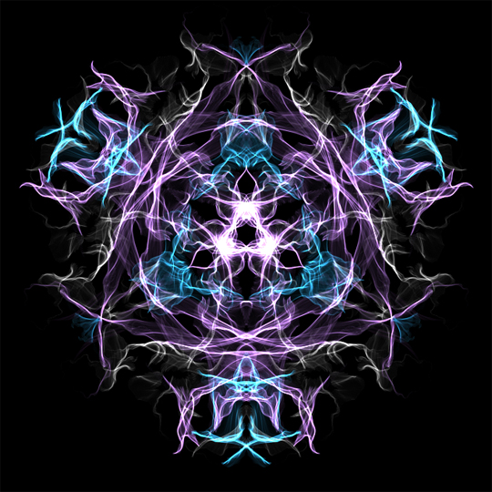

# hste0450_quiz_8

# Quiz 8
## Part 1
### Imaging Technique Inspiration             
One inspiring imaging technique in digital art is the use of randomness and generative processes to create dynamic, unpredictable visual outputs. An example of this approach is in *Yuri Vishnevsky*'s interactive artwork "Silk", where users generate flowing, silk-like patterns through mouse movements. 

The randomness in this algorithm ensures that each interaction creates a unique and non-repetitive visual output, enhancing the interactivity and personalization of the experience. This makes the artwork continually fresh and engaging, inviting users to explore the creative possibilities of their interactions. 

Incorporating randomness can help in creating an interactive design that is both captivating and unique for each user, supporting our objective to develop a visually and interactively rich emulation that responds creatively to user inputs or changing interaction dynamics. 

**Image examples of Silk artwork:**



*Example 1* :arrow_up:


*Example 2* :arrow_up:


## Part 2
### Coding Technique

For implementing the randomness and dynamic visuals inspired by *Yuri Vishnesky*'s "Silk", the `noise()` function in the p5.js library offers a solution. This function generates smooth, organic changes, perfect for creating the flowing, silk-like patterns like in Vishnevsky's artwork. 

By using `noise()`, we can sumulate the natural randomness needed to ensure that each user interaction produces unique, non-repetitive visual outputs. This technique will allow our project to dynamically vary visual elements in real-time, enhancing user engagement and personalization. 

**Code example:**
``` javascript
var t;

function setup() {
  createCanvas(400, 400);
  stroke(0, 18);
  noFill();
  t = 0;
}

function draw() {
  var x1 = width * noise(t + 15);
  var x2 = width * noise(t + 25);
  var x3 = width * noise(t + 35);
  var x4 = width * noise(t + 45);
  var y1 = height * noise(t + 55);
  var y2 = height * noise(t +65);
  var y3 = height * noise(t + 75);
  var y4 = height * noise(t + 85);

  bezier(x1, y1, x2, y2, x3, y3, x4, y4);

  t += 0.005;

  // clear the background every 500 frames using mod (%) operator
  if (frameCount % 500 == 0) {
	background(255);
  }
}
```
[Link to example code](https://genekogan.com/code/p5js-perlin-noise/)

- The `noise()`function generates coordinates that smoothly vary over time due to the gradual increase in the `t`variable. This results in the generation of curves that change, similar to the evolving patterns seen in "Silk"
- Each line’s position is determined by a `noise()` function, ensuring that each drawing cycle produces a new, unique pattern. Much like how each interaction with "Silk" produces a distinct visual output

**Screenshot of code output:**

